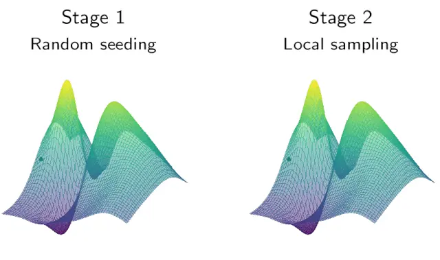

<div align="center"></div>

# PyHopper - Optimizing high-dimensional hyperparameters

 [](https://pyhopper.readthedocs.io/en/latest/?badge=latest) 


[**Website**](https://pyhopper.io)
| [**Docs**](https://pyhopper.readthedocs.io/)
| [**Paper**](https://arxiv.org/abs/2210.04728)
| [**Quickstart**](https://pyhopper.readthedocs.io/en/latest/quickstart.html)
| [](https://colab.research.google.com/drive/1UPzhfCNCagh4OjI0VQyq87TpFbGoFBBl?usp=sharing)


PyHopper is a hyperparameter optimizer, made specifically for high-dimensional problems arising in machine learning research and businesses.

```bash
pip3 install -U pyhopper
```

PyHopper is lightweight, rich in features, and requires minimal changes to existing code

```python
import pyhopper

def my_objective(params: dict) -> float:
    model = build_model(params["hidden_size"],...)
    # .... train and evaluate the model
    return val_accuracy

search = pyhopper.Search(
    units   = pyhopper.int(100,500),
    dropout = pyhopper.float(0,0.4,"0.1f"), # 1 decimal digit
    lr      = pyhopper.float(1e-5,1e-2,"0.1g"), # loguniform, 1 significant
    matrix  = pyhopper.float(-1,1,shape=(20,20)), # numpy array
    opt     = pyhopper.choice(["adam","rmsprop","sgd"]),
)
best_params = search.run(my_objective, "maximize", "8h", n_jobs="per-gpu")
```

Its most important features are

- 1-line multi-GPU parallelization
- native NumPy array hyperparameter support
- automatic runtime scheduling of exploration vs exploitation

Under its hood, PyHopper uses an efficient 2-stage Markov chain Monte Carlo (MCMC) optimization algorithm.



For more info, check out [PyHopper's documentation](https://pyhopper.readthedocs.io/)

Copyright ©2018-2022. Mathias Lechner  
Copyright ©2022. Massachusetts Institute of Technology  
Copyright ©2018-2022. Institute of Science and Technology Austria (IST Austria)  
Copyright ©2021-2022. Simple-AI  
