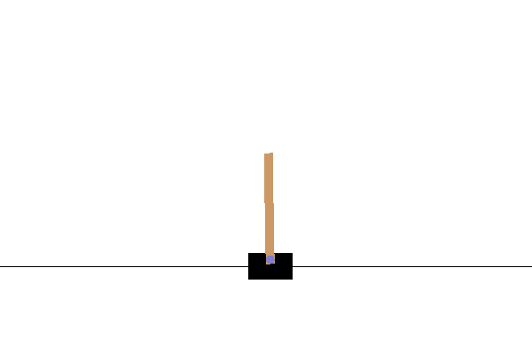

Gradient-free RL (Cartpole-v1)
-----------------------------------

We can use pyhopper to even treat the weights of a neural network as hyperparameters.
For instance

.. code-block:: python

    import numpy as np
    import gym
    import pyhopper

    def replay_policy(policy, render=False):
        done = False
        x = env.reset()
        total_reward = 0
        while not done:
            # Forward pass of MLP with tanh activation
            x = np.tanh(np.dot(x, policy["w1"]) + policy["b1"])
            # Second layer with 2 output classes
            x = np.argmax(np.dot(x, policy["w2"]) + policy["b2"])
            x, r, done, info = env.step(x)
            total_reward += r
        return total_reward

    search = pyhopper.Search(
        {
            "w1": pyhopper.float(shape=(4, 64)),
            "b1": pyhopper.float(shape=(64,)),
            "w2": pyhopper.float(shape=(64, 2)),
            "b2": pyhopper.float(shape=(2,)),
        }
    )

    env = gym.make("CartPole-v1")
    policy = search.run(
        pyhopper.wrap_n_times(replay_policy, n=5),
        direction="max",
        timeout="1s",
        n_jobs=4,
    )

trains an MLP with one hidden layer to a maximum reward of 500 in less than a second

