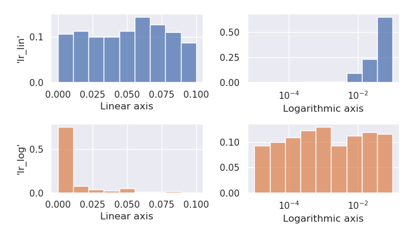
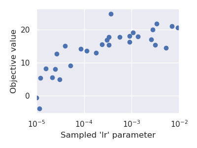

=========================
Quickstart
=========================

This is the quickstart guide of PyHopper

-----------------------------
The Search class
-----------------------------

The central component of PyHopper is the :meth:`pyhopper.Search` class whose constructor defines the search space and :code:`run` method performs the hyperparameter search.
For example

.. code-block:: python

    import pyhopper

    def dummy_objective(param :dict) -> float:
        print(param)
        return 0

    search = pyhopper.Search(
        {
            "my_const": "cifar10",
            "my_int": pyhopper.int(100,500),
            "my_float": pyhopper.float(0,0.4),
            "my_choice": pyhopper.choice(["adam","rmsprop","sgd"]),
        }
    )
    search.run(dummy_objective,"maximize",steps=5,quiet=True)

outputs

.. code-block:: text

    > {'my_const': 'cifar10', 'my_int': 364, 'my_float': 0.3404501564, 'my_choice': 'sgd'}
    > {'my_const': 'cifar10', 'my_int': 408, 'my_float': 0.1056544366, 'my_choice': 'adam'}
    > {'my_const': 'cifar10', 'my_int': 206, 'my_float': 0.2091606387, 'my_choice': 'adam'}
    > {'my_const': 'cifar10', 'my_int': 438, 'my_float': 0.1960442887, 'my_choice': 'sgd'}
    > {'my_const': 'cifar10', 'my_int': 156, 'my_float': 0.2719664365, 'my_choice': 'sgd'}

.. info::

    :code:`pyhopper.Search` either accepts a :code:`dict` or named arguments in the form of :code:`pyhopper.Search(my_int=pyhopper.int(100,500), my_const="cifar10")`

.. note::

    Removing :code:`quiet=True` prints a progress bar during the search and a short summary at the end.


-----------------------------
Hyperparameter types
-----------------------------

As shown above, PyHopper has three built-in template types: :meth:`int`, :meth:`float`, and :meth:`choice` (see :ref:`API docs<parameters>`).

:meth:`pyhopper.int` requires a lower and an upper bound (inclusive bounds) defining the range of the search space.
Optionally, we can provide an initial *guess* for the parameter via the `init` argument. We can also constrain the parameter to be a multiple of something or a power of 2 (which may be required by certain `neural network acceleration hardware <https://developer.nvidia.com/blog/optimizing-gpu-performance-tensor-cores/>`_).
For instance,

.. code-block:: python

    search = pyhopper.Search(
        {
            "layers": pyhopper.int(1, 8),
            "epochs": pyhopper.int(10, 50, init=30),
            "num_units": pyhopper.int(100, 500, multiple_of=100),
            "batch_size": pyhopper.int(32, 512, power_of=2),
        }
    )

generates the samples

.. code-block:: text

    > {'layers': 6, 'epochs': 30, 'num_units': 400, 'batch_size': 128}
    > {'layers': 8, 'epochs': 31, 'num_units': 400, 'batch_size': 32}
    > {'layers': 4, 'epochs': 21, 'num_units': 500, 'batch_size': 32}
    > {'layers': 3, 'epochs': 21, 'num_units': 400, 'batch_size': 64}
    > {'layers': 5, 'epochs': 24, 'num_units': 400, 'batch_size': 32}


:meth:`pyhopper.float`, similar to before, accepts inclusive lower and upper bounds and an optional initial guess.
Hyperparameters often span over multiple orders of magnitude. For instance, the optimal learning rate of a neural network
could be in the range from 0.00001 to 0.1.
Drawing uniform samples from this range favors larger values, as the center of the interval is approximately 0.05, which means that half of all generated samples will be larger than 0.05 on average.

For such parameters, **logarithmic** sampling, enabled via the :code:`log` argument, is a better option

.. code-block:: python

    search = pyhopper.Search(
        {
            "dropout": pyhopper.float(0, 0.5),
            "lr_lin": pyhopper.float(1e-5, 1e-1),           # linear
            "lr_log": pyhopper.float(1e-5, 1e-1, log=True), # logarithmic
        }
    )

.. code-block:: text

    > {"dropout": 0.11816788326, "lr_lin": 0.05527447103, "lr_log": 0.00123320712}
    > {"dropout": 0.03368100192, "lr_lin": 0.04697054821, "lr_log": 0.00001454088}
    > {"dropout": 0.19095931974, "lr_lin": 0.00770115557, "lr_log": 0.02469411646}
    > {"dropout": 0.13041185714, "lr_lin": 0.05653078541, "lr_log": 0.00185817307}
    > {"dropout": 0.29153194475, "lr_lin": 0.08468031050, "lr_log": 0.04448428726}

Looking at the histogram of both parameters' samples illustrates this effect better:



Keeping all digits of a float parameter looks ugly and *increases the chance of* **overfitting**.
To limit the precision, we can use the :code:`precision` argument.
:code:`precision` defines the number of digits after the comma in the default linear sampling mode, whereas the number of significant digits in the logarithmic mode.

.. code-block:: python

    search = pyhopper.Search(
        {
            "dropout": pyhopper.float(0, 0.5, precision=2),          # 2 digits after the comma
            "lr": pyhopper.float(1e-5, 1e-1, log=True, precision=1), # 1 significant digit
        }
    )

.. code-block:: text

    > {'dropout': 0.04, 'lr': 0.0001}
    > {'dropout': 0.11, 'lr': 0.02}
    > {'dropout': 0.37, 'lr': 0.008}
    > {'dropout': 0.13, 'lr': 0.0001}
    > {'dropout': 0.20, 'lr': 0.0009}

.. note::

    The `precision` and `log` arguments can also be set via the `fmt` (format string) argument. For instance, `fmt="0.2f"`` is short for `log=False, precision=2`, and `fmt="0.1g"` is short for `log=True, precision=1`.

    .. code-block:: python

        search = pyhopper.Search(
            {
                "dropout": pyhopper.float(0, 0.5, "0.2f"), # 2 digits after the comma (linear)
                "lr": pyhopper.float(1e-5, 1e-1, "0.1g")), # 1 significant digit (logarithmic)
            }
        )

:meth:`pyhopper.choice` requires a :code:`list` of possible values for this hyperparameter.
Similar to before, we can provide an initial guess.
In case the values in the list are provided in a **structured order**, setting the :code:`is_ordinal` argument indicates pyhopper to preserve this order when sampling.
For instance in

.. code-block:: python

    search = pyhopper.Search(
        {
            "opt": pyhopper.choice(["adam", "rmsprop", "sgd"]),
            "dropout": pyhopper.choice([0, 0.1, 0.2, 0.3], is_ordinal=True),
        }
    )

the parameter :code:`"opt"` has no ordering but :code:`"dropout"` has, making pyhopper sample items adjacent to the current best value.

.. code-block:: text

    {'opt': 'adam', 'dropout': 0.3}
    {'opt': 'adam', 'dropout': 0.2}
    {'opt': 'sgd', 'dropout': 0.3}

-----------------------------
Running PyHopper
-----------------------------

Once we have defined the search space, we can schedule the search using the :meth:`pyhopper.Search.run` method.
The method requires three argument: The objective function, the direction of the search (minimize or maximize), and the runtime of the search.
For specifying the runtime, we can provide a string that is parsed by :meth:`pyhopper.parse_timeout` or simply an integer/float with the runtime in seconds.

.. code-block:: python

   timeout = 30               # 30 seconds
   timeout = "2h 10min"       # 2 hours and 10 minutes
   timeout = "3d 7h 30m 10s"  # 3 days, 7 hours, 30 minute and 10 seconds

To utilize multi CPU/GPU hardware, we can run multiple evaluations of parameter candidates in parallel with the :code:`n_jobs` argument.
For instance,

.. code-block:: python

   import pyhopper
   import time

   def of(param):
       time.sleep(1)      # some slow code
       return param["x"]

   search = pyhopper.Search({"x": pyhopper.float(0, 1)})

   start = time.time()
   search.run(of, steps=20, quiet=True)
   print(f"n_jobs=1 took {time.time()-start:0.2f} seconds")

   start = time.time()
   search.run(of, steps=20, quiet=True, n_jobs=4)
   print(f"n_jobs=4 took {time.time()-start:0.2f} seconds")

.. code-block:: text

   > n_jobs=1 took 20.19 seconds
   > n_jobs=4 took 5.08 seconds


Setting the argument to :code:`n_jobs="per-gpu"` will spawn exactly one worker process for each GPU attached to the machine.
Moreover, PyHopper will take care of setting the :code:`CUDA_VISIBLE_DEVICES` environment variable for each of the worker processes to its private GPU, so each worker *sees* only a single GPU.
Consequently, we can write standard PyTorch and TensorFlow code in the objective function without having to worry about two processes accessing the same device.
**TL;DR:** useful values for :code:`n_jobs` are:

.. code-block:: python

   n_jobs = 1            # No parallel workers
   n_jobs = 4            # 4 parallel workers
   n_jobs = "per-gpu"    # A worker for each GPU device
   n_jobs = "2x per-gpu" # 2 workers for each GPU device
   n_jobs = -1           # A worker for each CPU core


-----------------------------
A putting things together
-----------------------------

Putting everything together, a typical hyperparameter tuning code may look something like this

.. code-block:: python

    import pyhopper

    def my_objective(param: dict) -> float:
        # Add code here
        return val_acc

    search = pyhopper.Search(
        {
            "epochs": 20,
            "num_layers": pyhopper.int(1, 8, init=4),
            "batch_size": pyhopper.int(32, 512, multiple_of=32),
            "dropout": pyhopper.float(0, 0.5, precision=1),
            "lr": pyhopper.float(1e-5, 1e-2, log=True, precision=1),
            "opt": pyhopper.choice(["adam", "rmsprop", "sgd"], init="adam"),
            "weight_decay": pyhopper.choice([0, 1e-5, 1e-4, 1e-3], is_ordinal=True),
        }
    )
    search.run(my_objective, "max", "4h", n_jobs="per-gpu")


-----------------------------
Further topics
-----------------------------

The following topics give us some peak into the capabilities of Pyhopper.

^^^^^^^^^^^^^^^^^^^^^^^^^^^^^
Checkpointing
^^^^^^^^^^^^^^^^^^^^^^^^^^^^^

We can automatically save the search progress in a checkpoint file, so if the process is interrupted (for instance by the shutdown of a pre-emptive cloud instance) we can resume the process where it left off. 

.. code-block:: python

    search = pyhopper.Search( ... )

    search.run(
        objective, "minimize", "12h",
        checkpoint_path = "my_checkpoint.ckpt"

    search.save("run_completed.ckpt")
    # search.load("run_completed.ckpt")

If the file ``checkpoint_path`` already exists, Pyhopper will try to load it and resume the remaining search.
At the end of the search, the file will **not** be deleted and we can use it extend the search, for instance, running it for another day if we are not satisfied with the results.  

For further details see :ref:`checkpointing-label`


^^^^^^^^^^^^^^^^^^^^^^^^^^^^^^^^^
Dealing with a noisy objective
^^^^^^^^^^^^^^^^^^^^^^^^^^^^^^^^^

Training a neural network is an inherently stochastic process. Randomness from the weight initialization has a strong influence on the final accuracy.
In the context of a hyperparameter search, it may happen that a non-optimal parameter candidate achieves a high accuracy by simply having *luck* with the initial weights used for its evaluation.
To tell spurious and genuine high accuracy apart, we have to evaluate each parameter candidate several times and use the average accuracy as our objective metric.
For exactly this reason, PyHopper provides the :meth:`pyhopper.wrap_n_times` function that wraps an arbitrary function into its mean over n evaluations.

.. code-block:: python

    def noisy_objective(param):
        print(param["name"])
        return 0

    search = pyhopper.Search({"name": pyhopper.choice(["adam","eve"])})

    search.run(
        pyhopper.wrap_n_times(noisy_objective,3),
        "minimize",
        "3s"
    )

.. code-block:: text

    > adam
    > adam
    > adam
    > eve
    > eve
    > eve

.. note::

    To reduce the computational cost of evaluating each candidate multiple times, PyHopper allows cancelling candidates if
    their first evaluation shows that they have only a small chance of becoming the best hyperparameters. See :ref:`pruning-label` for more details.


^^^^^^^^^^^^^^^^^^^^^^^^^^^^^
Pruners
^^^^^^^^^^^^^^^^^^^^^^^^^^^^^

When wrapping an objective function with ```pyhopper.wrap_n_times(noisy_objective,3)```, we can potentially save a lot of compute if we discontinue an unpromising candidate after the evaluation. 
For instance, if our current best parameters evaluate to an accuracy of 95%, and a sampled candidate evaluates to 70% in the first evaluation, it does not make sense to evaluate the candidate two more times. 
Instead, we can *prune* the candidate.

.. code-block:: python

    search = pyhopper.Search(...)

    search.run(
        pyhopper.wrap_n_times(noisy_objective,3),
        "maximize",
        steps=50,
        pruner = pyhopper.pruners.QuantilePruner(0.8) # discontinue candidates if they are in the bottom 80%
    )

.. code-block:: text

    > Search is scheduled for 50 steps
    > Current best 0.0596: 100%|█████████████████████████| 50/50 [00:00<00:00, 101.45steps/s]
    > ======================= Summary ======================
    > Mode              : Best f : Steps : Pruned    : Time
    > -----------       : ---    : ---   : ---       : ---
    > Initial solution  : -4.09  : 1     : 0         : 9 ms
    > Random seeding    : 0.0596 : 6     : 43        : 60 ms
    > -----------       : ---    : ---   : ---       : ---
    > Total             : 0.0596 : 7     : 43        : 69 ms
    > ======================================================

For further details, see :ref:`pruning-label`.

^^^^^^^^^^^^^^^^^^^^^^^^^^^^^
Accessing the search history
^^^^^^^^^^^^^^^^^^^^^^^^^^^^^

Pyhopper keeps track of all evaluated parameter candidates and corresponding objective value in the ``Search.history`` property. 
We can, for instance, use this history to examine or visualize the search space. 

.. code-block:: python

    search = pyhopper.Search(
        {
            "lr": pyhopper.float(1e-5,1e-2,log=True),
        }
    )
    search.run(...)

    fig, ax = plt.subplots(figsize=(4, 3))
    b = ax.scatter(
        x=search.history["lr"],
        y=search.history.fs,
    )
    ax.set_xlabel("Sampled 'lr' parameter")
    ax.set_ylabel("Objective value")
    ax.set_xscale("log")
    plt.show(fig)




For further details see See :ref:`history-label`.