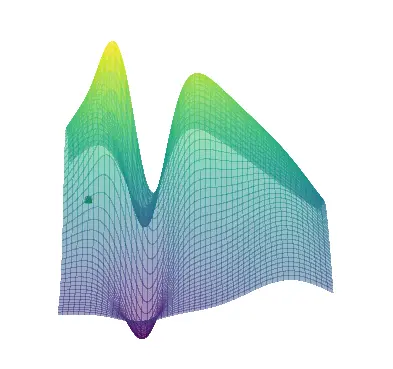

.. _quickstart:

Quickstart
==========

This is the quickstart guide of PyHopper

PyHopper's search algorithm
--------------

PyHopper uses a 2-stage MCMC-based optimization algorithm.
In the first random seeding stage, PyHopper randomly samples candidates from the entirety of the search space.
The purpose of this stage is to spot the most promising part of the search space quickly.

.. image:: img/seedign.webp

In the second neighborhood sampling stage, PyHopper takes the current best parameter and mutates it to obtain a slightly different candidate.
If the newly generated parameter is better than its predecessor, it is stored as the new best parameter.
Otherwise, it will be discarded. The randomness of the mutation step is modulated by a temperature parameter that decreases over the algorithm's runtime.

As evaluating a candidate is costly, a smart hashing routine takes care that no candidate is evaluated twice.
This 2-stage process allows PyHopper to explore and exploit parameter spaces with millions of dimensions efficiently.

User’s Guide
--------------

 .. toctree::
    :maxdepth: 2

.. py:function:: enumerate(sequence[, start=0])

   Return an iterator that yields tuples of an index and an item of the
   *sequence*. (And so on.)

.. py:class:: Bar

   Example test

   .. py:method:: Bar.quux()

      This is a simple method

   .. py:method:: Bar.__init__(a,c)

      this is the init function

      .. code-block:: python

          x = Bar(1,"hello")
          x.print()

.. py:class:: Foo4

   .. py:method:: quux