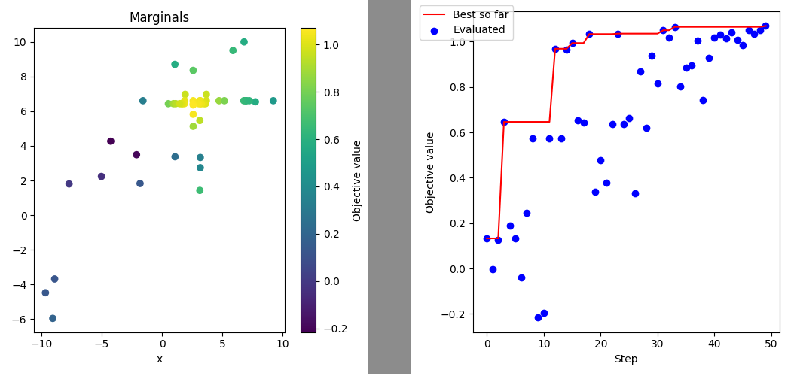

.. _history-label:

Search history
----------------------------------------------------------

In some cases we are not only interested in the best hyperparameter but the entire distribution of hyperparameters and
corresponding objective values.
Pyhopper keeps track of all evaluated candidates in the :attr:`pyhopper.Search.history` property.

.. code-block:: python

    import numpy as np
    import matplotlib.pyplot as plt

    import pyhopper

    def gauss(x, y, mux, muy, sx, sy):
        return np.exp(-1 / sx * np.square(x - mux)) * np.exp(-1 / sy * np.square(y - muy))

    def objective(x, y):
        v = gauss(config["x"], config["y"], 2, 5, 10, 5)
        v -= 1.2 * gauss(config["x"], config["y"], 3, 4, 50, 5)
        v += 0.3 * gauss(config["x"], config["y"], -3, -7, 80, 20)
        v += gauss(config["x"], config["y"], 5, 3, 50, 100)
        return v

    search = pyhopper.Search(
        {
            "x": pyhopper.float(-10, 10),
            "y": pyhopper.float(-10, 10),
        },
    )
    search.run(objective, direction="max", seeding_steps=10, steps=50)

    # Let's plot the sampled parameters as the 2D objective surface
    fig, ax = plt.subplots(figsize=(5, 5))
    b = ax.scatter(
        x=search.history["x"],
        y=search.history["y"],
        c=search.history.fs,
    )
    ax.set_ylabel("y")
    ax.set_xlabel("x")
    ax.set_title("Marginals")
    fig.colorbar(b, ax=ax, label="Objective value")
    fig.tight_layout()
    fig.savefig("marginal.png")
    plt.close(fig)

    # Let's plot evaluated objective values over the optimization process
    fig, ax = plt.subplots(figsize=(5, 5))
    ax.plot(search.history.steps, search.history.best_fs, color="red", label="Best so far")
    ax.scatter(x=search.history.steps, y=search.history.fs, color="blue", label="Evaluated")
    ax.set_xlabel("Step")
    ax.set_ylabel("Objective value")
    fig.legend(loc="upper left")
    fig.tight_layout()
    fig.savefig("search.png")
    plt.close(fig)

will generate the figures :code:`marginal.png` and :code:`search.png`

