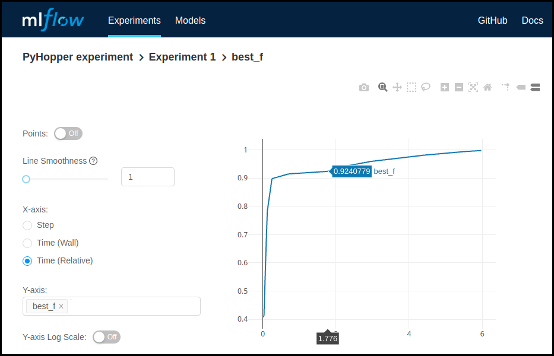

MLflow and Weights & Biases integration
----------------------------------------------------------

Hyperparameter experiments can be integrated with the tracking and visualization interface of `MLflow <https://mlflow.org/>`_ and `Weights & Biases <https://wandb.ai/>`_ via PyHopper's callback API.
The two callbacks :meth:`pyhopper.callbacks.mlflow.MLflowCallback` and :meth:`pyhopper.callbacks.wandb.WandbCallback` send the value of every evaluated parameter candidate
to the experiment tracking system of these two platforms. Moreover, the final best hyperparameters are stored as well through MLflow's and wandb's **artifact** API.
For instance, the intermediate best hyperparameters of

.. code-block:: python

    import numpy as np
    import pyhopper
    from pyhopper.callbacks.mlflow import MLflowCallback
    from pyhopper.callbacks.wandb import WandbCallback

    def of(param):
        return np.random.default_rng().random()

    search = pyhopper.Search(
        {
            "a": pyhopper.float(0, 1),
            "b": pyhopper.int(50, 100),
            "c": pyhopper.choice([0, 1, 2]),
        },
    )
    search.run(
        of,
        "max",
        "10s",
        callbacks=[
            MLflowCallback("PyHopper experiment", "Experiment 1"),
            WandbCallback(project="PyHopper", name="Experiment 1"),
        ],
    )

are visualized in MLflow as

