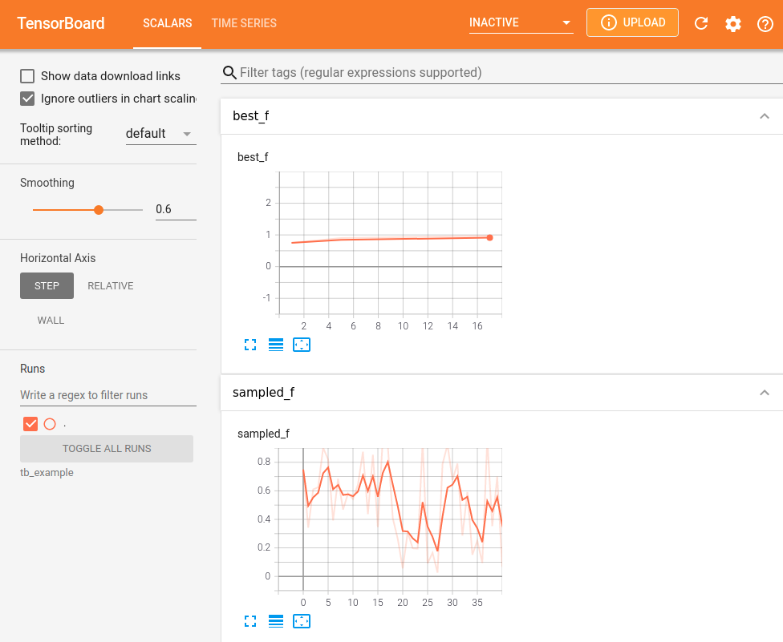

Tracking with Tensorboard
----------------------------------------------------------

Hyperparameter experiments can be tracked with `Tensorboard <https://www.tensorflow.org/tensorboard/get_started/>`_ and `Weights & Biases <https://wandb.ai/>`_ via the  :meth:`pyhopper.callbacks.tensorboard.TensorboardCallback` callback.

.. attention::

    The callback implementation is based on the :code:`tensorboardX` package which is not explicitly set as requirement for PyHopper. Thus you may need to install it via

    .. code-block:: bash

        pip3 install -U tensorboardx

For instance,

.. code-block:: python

    import time

    import pyhopper
    from pyhopper.callbacks.tensorboard import TensorboardCallback

    def of(param):
        time.sleep(1)
        return np.random.default_rng().random()

    search = pyhopper.Search(
        {
            "a": pyhopper.float(0, 1),
            "b": pyhopper.int(50, 100),
            "c": pyhopper.choice([0, 1, 2]),
        },
    )
    search.run(
        of,
        "max",
        "3min",
        callbacks=[
            TensorboardCallback("tb_example",comment="My experiment"),
        ],
    )

are visualized in Tensorboard as

